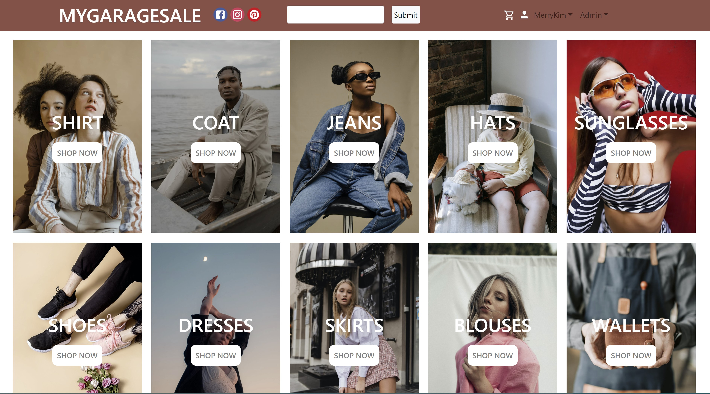
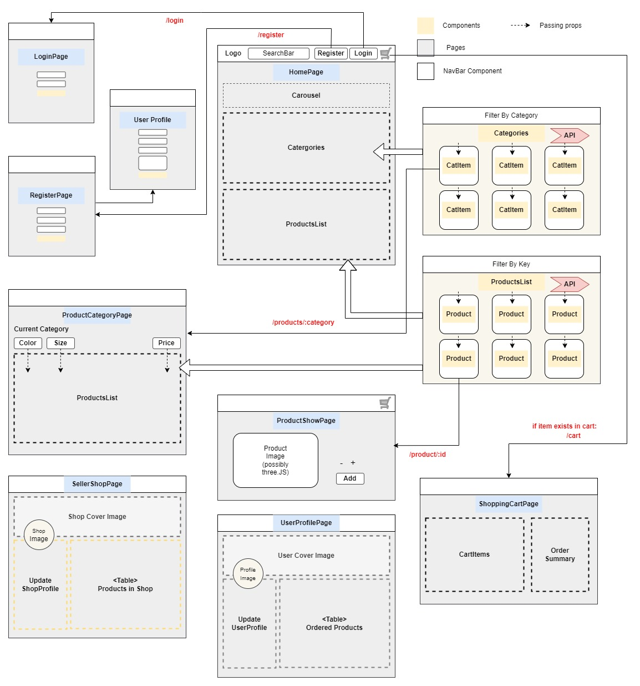
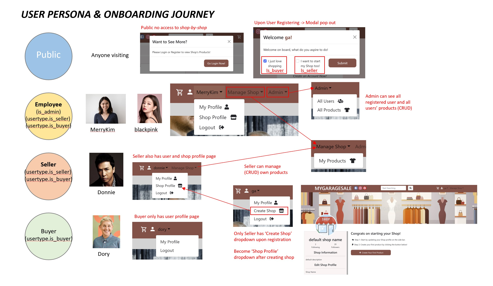
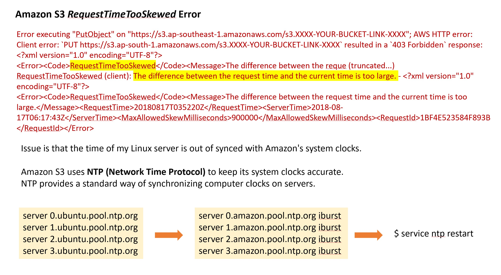

# GarageSale

Access [Live Demo](https://mygaragesale.herokuapp.com/)

A full-stack responsive ecommerce marketplace built with React and Django. The application allows user to have an option to become seller and create their own shops. Users are able to create and add products to shops and is also able to shop for products. Django default Auth model are being extended to include the buyer and seller usertypes.

1. Customised caurosel on Homepage
2. Product Filtering by Color and Sorting by Prices
3. Three different User types - Buyer, Seller and Admin
4. Seller is able to create Shops and Add products to Shop
5. All user has a user profile which allows them to upload profile images
6. All images are being stored on Amazon S3
7. Paypal check out payment capability



## Main Tech Stack:

- ReactJS - front end
- Redux - state management
- DjangoRestFrameowork - backend API
- NodeJS - npm package management
- PostsgreSQL - relational database
- Paypal API - check out Payment Gateway
- Amazon S3 - storage of product images
- Heroku - deployment together with gunicorn webserver

## Styled using a mixed of the following:

- Styled-components
- CSS Flexbox
- React-bootstrap (Container, Rows, Columns)
- Material UI (for some Icons)
- TailWind CSS (used some classNames for inline margins and paddings offset)

## Authorisation & Authentication:

- JWT Tokens
- Set Local Storage

## Extending Django User Model:

```python
# models.py
class UserType(models.Model):
    id = models.AutoField(primary_key=True, editable=False)
    user = models.OneToOneField(User,on_delete=models.SET_NULL, null=True)
    is_seller = models.BooleanField(default=False)
    is_buyer = models.BooleanField(default=False)
    bio = models.TextField(null=True, blank=True)
    profile_image = models.ImageField(default='images/noAvatar.png',null=True, blank=True)
    cover_image = models.ImageField(default='images/userCoverImage.jpg',null=True, blank=True)

    @receiver(post_save, sender=User)
    def create_user_type(sender, instance, created, **kwargs):
        if created:
            UserType.objects.get_or_create(user=instance)

    @receiver(post_save, sender=User)
    def save_user_type(sender, instance, **kwargs):
        instance.usertype.save()

    def __str__(self):
        return str(self.user)
```

```python
# serializers.py
class UserSerializer(serializers.ModelSerializer):
    name = serializers.SerializerMethodField(read_only=True)
    isAdmin = serializers.SerializerMethodField(read_only=True)
    usertype = serializers.SerializerMethodField(read_only=True)

    class Meta:
        model = User
        fields = ['id', 'username', 'email', 'name', 'isAdmin', 'date_joined', 'usertype']

    # customised default is_staff to isAdmin
    def get_isAdmin(self, obj):
        return obj.is_staff

    #customised usertype to include seller and buyer
    def get_usertype(self,obj):
        usertype = obj.usertype
        serializer = UserTypeSerializer(usertype, many=False)
        return serializer.data

```

## MVP:

The MVP will have the essential features of an ecommerce applications such as:

1. Shop Products by Categories
2. Filter Products by colors and sort by prices
3. Add 3 user type - Buyer(by default), Seller(by choice), Admin
4. Shop Products by Shops
5. Add to Cart Feature
6. Check out Feature
7. Paypal payment gateway



## User Persona & Onboarding Journey:



### To-do Checklist:

- [x] Add Navbar and Footer
- [x] Design Layout using CSS Flexbox with styled-components/ react-bootstrap
- [x] Display all Categories on HomePage
- [x] Display 8 Products on HomePage
- [x] Add Caurosel on HomePage
- [x] Fix the login credentials
- [x] store JWTs inside an httpOnly cookie (avoid XSS attack)
- [x] Create Redux store, slice and actions
- [x] useSelector and useDispatch to connect components to store
- [x] Add to Cart Features
- [x] Delete From Cart Features
- [x] Store Product Image JPEG on AWS S3
- [x] Add Product Reviews
- [x] Add Paypal or Stripe CheckOut
- [x] Add Order Success Page
- [x] Add Admin Dashboard
- [x] Add Seller usertype
- [x] Add create Shop for sellers
- [x] Hide credentials with environ
- [x] Image upload to AWS S3 for storage
- [ ] Deployment to Heroku

## Future Development:

- [ ] React3Fiber - 3D features
- [ ] ThreeJS - 3D features for product viewing
- [ ] ReactDnD - Drag&Drop features for cart
- [ ] Add Follow Favorite Product
- [ ] Add Follow Favorite Shop
- [ ] Metamask Login Options for user to remain anonymous
- [ ] Login via Google OAuth Options/ Passport JS
- [ ] Email notification/verification upon Account registration
- [ ] WhatsApp or Telegram notification upon Order Completion
- [ ] Add product/shop location and user location
- [ ] Map distance to show Product Delivery time upon Order Completion
- [ ] Add Chat function with socket.io features
- [ ] Add Chat icon fixed on Bottom right

## Some Learning Points



## Key commands for future reference

### To launch frontend

```
cd client
npm start
```

### For backend

```python
# python, django, postgresql
sudo service postgresql start
pipenv run python manage.py runserver
pipenv run python manage.py runmigrations
pipenv run python manage.py migrate
```
